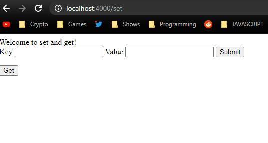

<h3>Database Server</h3> 

<h5>Runs in browser</h5>

**To begin:**
- At project root execute `bundle install`
- Execute `rerun -- rackup --port 4000 config.ru`

**To run tests:**
- Execute command `rspec` at project root

**Test suite justification:** 

**Phase one**

There are no units to test, outside of a placeholder DatabaseConnection unit.
Therefore in order to complete Phase One acceptance criteria, only feature tests were required.
Feature test illustrates the User Journey of both setting and getting of a key and a given value.

**Acceptance criteria**

You receive a message from a prospective employer:
 
- Before your interview, write a program that runs a server that is accessible on http://localhost:4000/. 
- When your server receives a request on http://localhost:4000/set?somekey=somevalue it should store the passed key and value in memory. 
- When it receives a request on http://localhost:4000/get?key=somekey it should return the value stored at somekey. Store the data in memory, not in a database, but bear in mind that you will later need to add a database to this code."
 
- Create a new git repository and write code to fulfill the brief to the best of your ability. 
- We will be looking for clean, well tested code in your choice of technology. 
- In addition, the last sentence of the brief implies that you should consider how the code could easily be extended to add an as-yet-unknown data store.
- If you still have time at the end of the day, you can extend the code by adding a data store of your choice.