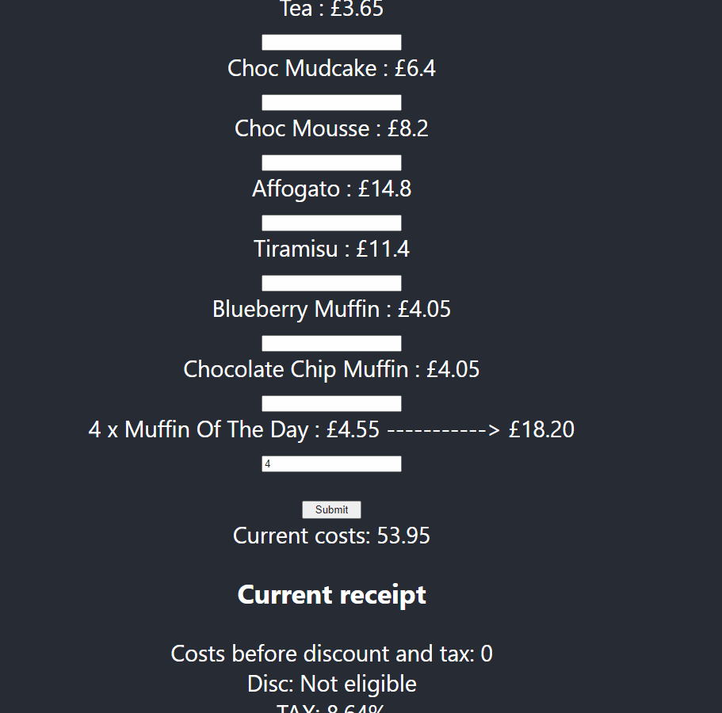

## Requirements

### Version 1
Implement a system that contains the business logic to produce receipts similar to this, based on a json price list and test orders. A sample .json file has been provided with the list of products sold at this particular coffee shop.

##### Jane
2 x Cafe Latte
1 x Blueberry Muffin
1 x Choc Mudcake

##### John
4 x Americano
2 x Tiramisu
5 x Blueberry Muffin

- The receipt must calculate and show the correct amount of tax (in this shop's case, 8.64%), as well as correct line totals and total amount. Do not worry about calculating discounts or change yet. Consider what output formats may be suitable.

### Version 2
- Add functionality to take payment and calculate correct change.
- Add functionality to handle discounts - in this example, a 5% discount on orders over $50, and a 10% muffin discount.

### Version 3
- Implement a user interface that can actually be used as a till.

### To run the application: `npm start`

Runs the app in the development mode. 
Open [http://localhost:3000](http://localhost:3000) to view it in the browser.

The page will reload if you make edits. 
You will also see any lint errors in the console.

### To run the tests: `npm test`

Launches the test runner in the interactive watch mode. 
See the section about [running tests](https://facebook.github.io/create-react-app/docs/running-tests) for more information.
